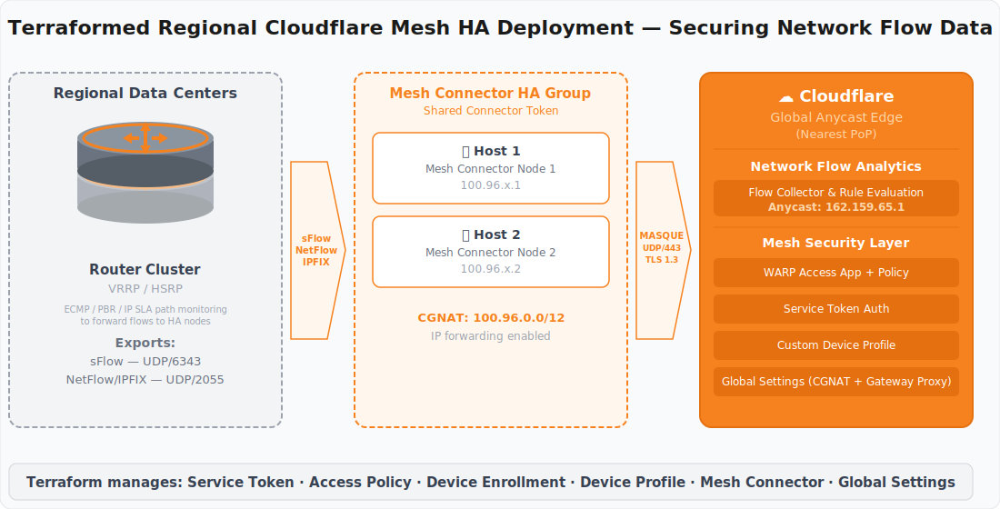

# deploy-ha-cf-mesh

Terraform project that deploys a highly-available [Cloudflare Mesh](https://developers.cloudflare.com/cloudflare-one/networks/connectors/cloudflare-mesh/) (formerly WARP Connector) configuration with install scripts for Debian and RHEL hosts. Secures network flow data (sFlow/NetFlow/IPFIX) from routers through encrypted WARP tunnels to the Cloudflare global anycast edge.



## What Gets Created

| Resource | Description |
|----------|-------------|
| **Service Token** | Enables headless (non-interactive) device enrollment |
| **Access Policy** | Service Auth policy allowing the service token |
| **Device Enrollment App** | WARP-type Access Application wired to the service auth policy |
| **Custom Device Profile** | "sFlow" profile — Traffic Only mode, Include split-tunnel for `162.159.65.1/32` (also covers NetFlow/IPFIX to the same collector) |
| **Mesh Connectors** | One HA connector per region (controlled by the `regions` variable) |
| **Global Device Settings** | Enables unique CGNAT IPs per device and Gateway proxy (TCP/UDP) — both required for Mesh |
| **Install Scripts** | Per-connector Debian and RHEL bash scripts with firewall rules and automatic MNM (Magic Network Monitoring) device registration |

## Prerequisites

- [Terraform](https://developer.hashicorp.com/terraform/install) >= 1.5
- A Cloudflare API token with the permissions listed below
- **One of:**
  - A [Terraform Cloud / HCP Terraform](https://app.terraform.io) workspace, **or**
  - A local Terraform installation (state stored on disk or any remote backend you configure)

### Manual Dashboard Setting (not yet in Terraform)

The following setting **must be enabled manually** in the Cloudflare dashboard before Mesh will work:

1. Go to [Cloudflare One](https://one.dash.cloudflare.com) → **Settings** → **WARP Client** → **Device settings** → **Global settings**
2. Enable **Allow all Cloudflare One traffic to reach enrolled devices**

This setting allows traffic on-ramped via Mesh/WAN to route to enrolled devices. There is currently no Terraform provider attribute for it.

> **Reference:** [Allow all Cloudflare One traffic to reach enrolled devices](https://developers.cloudflare.com/cloudflare-one/team-and-resources/devices/cloudflare-one-client/configure/settings/#allow-all-cloudflare-one-traffic-to-reach-enrolled-devices)

The remaining global settings (unique device IPs, Gateway proxy) are managed automatically by the `cloudflare_zero_trust_device_settings` resource in `global_settings.tf`.

### API Token Permissions

Create a [custom API token](https://dash.cloudflare.com/profile/api-tokens) scoped to your account with the following permissions:

| Permission | Access Level | Used By |
|------------|-------------|---------|
| **Access: Apps and Policies** | Edit | Device enrollment application, access policy |
| **Access: Service Tokens** | Edit | Service token for headless enrollment |
| **Cloudflare One Connectors** | Edit | Mesh connector creation and token retrieval |
| **Zero Trust** | Edit | Custom device profile |
| **Magic Network Monitoring Admin** | Edit | MNM configuration (router → WARP device mapping) |
| **Account Settings** | Read | Account-level resource lookups |

### Input Variables

The following variables must be set regardless of which backend you use. See [Set Variables](#3-set-variables) for how to provide them.

| Variable | Sensitive | Description |
|----------|-----------|-------------|
| `cloudflare_account_id` | **Yes** | Your Cloudflare account ID |
| `cloudflare_api_token` | **Yes** | API token with the permissions above |
| `team_name` | No | Zero Trust org name (the `<team>` in `<team>.cloudflareaccess.com`) |
| `warp_app_id` | No | *(Optional)* Existing WARP Access Application ID — leave empty for fresh deploys (see [step 2](#2-check-for-existing-warp-app)) |
| `regions` | No | *(Optional)* List of region identifiers — one HA connector per region (default: `["default"]`) |

## Firewall Requirements

The Mesh connector hosts need outbound access to the Cloudflare edge **and** inbound access from network devices sending flow data.

### Connector host → Cloudflare edge (outbound)

These ports must be allowed **outbound** from each connector host. The install scripts configure local firewall rules automatically (UFW on Debian, firewalld on RHEL).

| Port | Protocol | Purpose |
|------|----------|---------|
| 2408 | UDP | Cloudflare WARP tunnel (primary) |
| 500 | UDP | IKE — IPsec key exchange (fallback) |
| 4500 | UDP | NAT-T — IPsec NAT traversal (fallback) |
| 443 | TCP | HTTPS — WARP registration & API |
| 443 | UDP | MASQUE — HTTP/3 tunnel transport |

> **Tip:** If your network restricts egress, at minimum allow UDP 2408 and TCP 443 to Cloudflare IPs (`162.159.193.0/24`, `162.159.192.0/24`). See the [WARP ingress IP list](https://developers.cloudflare.com/cloudflare-one/connections/connect-devices/warp/deployment/firewall/).

### Router / network device → connector host (inbound)

Flow data must be able to reach the connector host from your routers or switches.

| Port | Protocol | Purpose |
|------|----------|---------|
| 6343 | UDP | sFlow |
| 2055 | UDP | NetFlow v5/v9 |
| 4739 | UDP | IPFIX |

> These are the standard default ports. Adjust if your devices export on non-standard ports. The install scripts do **not** open these automatically — add inbound rules for the flow ports your environment uses.

## Quick Start

### 1. Configure Backend

Choose a backend by copying one of the provided examples to `backend.tf` (which is gitignored):

**Terraform Cloud / HCP Terraform:**

```bash
cp backend.tf.cloud-example backend.tf
# Edit backend.tf with your organization and workspace name
```

Or set environment variables instead of editing the file:

```bash
export TF_CLOUD_ORGANIZATION="YourOrg"
export TF_WORKSPACE="your-workspace"
cp backend.tf.cloud-example backend.tf
```

**Local state (on-premises):**

```bash
cp backend.tf.local-example backend.tf
```

> You can also configure any other [Terraform backend](https://developer.hashicorp.com/terraform/language/backend) (S3, GCS, Consul, etc.) in `backend.tf`.

### 2. Check for Existing WARP App

Every Cloudflare account can have at most one WARP-type Access Application. Check if one already exists:

```bash
curl -s "https://api.cloudflare.com/client/v4/accounts/<ACCOUNT_ID>/access/apps" \
  -H "Authorization: Bearer <API_TOKEN>" | jq '.result[] | select(.type=="warp") | .id'
```

- **If it returns a UUID** → you have an existing WARP app. Set `warp_app_id` to that UUID (see step 3). Terraform will import the existing app into state instead of trying to create a duplicate (which would fail with a 409 error).
- **If it returns empty** → this is a fresh account with no WARP app. Do **not** set `warp_app_id`. Terraform will create the app automatically.

### 3. Set Variables

**Terraform Cloud / HCP Terraform** — add the following as **Terraform variables** (not environment variables) in your [workspace settings](https://app.terraform.io):

| Variable | Sensitive | Required | Value |
|----------|-----------|----------|-------|
| `cloudflare_account_id` | **Yes** | Yes | Your Cloudflare account ID |
| `cloudflare_api_token` | **Yes** | Yes | API token with [required permissions](#api-token-permissions) |
| `team_name` | No | Yes | Zero Trust org name (`<team>` in `<team>.cloudflareaccess.com`) |
| `warp_app_id` | No | Only if step 2 returned a UUID | The UUID from step 2 |

> **TFC note:** "not set" means the variable does not exist in the workspace at all. Do not create `warp_app_id` and set it to `""` — TFC will pass literal quotes which causes an error.

**Local / on-premises** — use a tfvars file:

```bash
cp terraform.tfvars.example temp.auto.tfvars
# Edit temp.auto.tfvars with your values (this file is gitignored)
```

### 4. Deploy

```bash
terraform init
terraform plan
terraform apply
```

On **first apply**, the `import` block in `device_enrollment.tf` will automatically import the existing WARP application into Terraform state. Subsequent applies will manage it normally.

### 5. Enable Mesh Connectivity (Manual)

After the first apply, enable this setting in the Cloudflare dashboard:

1. Go to [Cloudflare One](https://one.dash.cloudflare.com) → **Settings** → **WARP Client** → **Device settings** → **Global settings**
2. Enable **Allow all Cloudflare One traffic to reach enrolled devices**

> This is required for Mesh and cannot yet be managed by Terraform.

### 6. Retrieve Connector Tokens

Connector tokens are marked as sensitive. Each region has its own token.

```bash
# Get all tokens as JSON
terraform output -json connector_tokens

# Get a single region's token
terraform output -json connector_tokens | jq -r '.["us-east"]'
```

> **TFC users:** If running from a machine without local state, run `terraform init` first so the CLI can read remote state.

You can also retrieve the service token secret:

```bash
terraform output -raw service_token_client_secret
```

### 7. Deploy to Hosts (HA)

HA is achieved by installing the **same connector token** on multiple hosts within a region. Each host registers as a replica of that region's Mesh connector.

The install scripts are in `scripts/` and accept four arguments. Copy the appropriate script to each host and run it:

```
Usage: install_debian.sh <CONNECTOR_TOKEN> <ROUTER_IPS> <ACCOUNT_ID> <API_TOKEN>
       install_rhel.sh   <CONNECTOR_TOKEN> <ROUTER_IPS> <ACCOUNT_ID> <API_TOKEN>
```

- **CONNECTOR_TOKEN** — from `terraform output -json connector_tokens | jq -r '."<region>"'`
- **ROUTER_IPS** — comma-separated IPs of routers whose flow data this node tunnels (e.g. `"10.1.0.1"` or `"10.1.0.1,10.1.0.2"`)
- **ACCOUNT_ID** — your Cloudflare account ID
- **API_TOKEN** — Cloudflare API token with MNM Admin permission

**Debian/Ubuntu:**

```bash
# Replace "us-east" with the target region
TOKEN=$(terraform output -json connector_tokens | jq -r '.["us-east"]')
ROUTER_IPS="10.1.0.1"  # comma-separate for multiple routers

for host in host1 host2; do
  scp scripts/install_debian.sh user@${host}:~/
  ssh user@${host} "chmod +x ~/install_debian.sh && sudo ~/install_debian.sh $TOKEN $ROUTER_IPS $ACCOUNT_ID $API_TOKEN"
done
```

**RHEL/CentOS/Fedora:**

```bash
TOKEN=$(terraform output -json connector_tokens | jq -r '.["us-east"]')
ROUTER_IPS="10.1.0.1"

for host in host1 host2; do
  scp scripts/install_rhel.sh user@${host}:~/
  ssh user@${host} "chmod +x ~/install_rhel.sh && sudo ~/install_rhel.sh $TOKEN $ROUTER_IPS $ACCOUNT_ID $API_TOKEN"
done
```

The install scripts will:
1. Install the Cloudflare WARP client
2. Enable IP forwarding (`net.ipv4.ip_forward=1`)
3. Configure firewall rules (UFW or firewalld) for WARP/MASQUE ports
4. Register the host as a Mesh connector replica using `warp-cli connector new`
5. Auto-register the WARP device with Magic Network Monitoring (MNM)

### 8. Verify

After install, verify each host is connected:

```bash
ssh user@host1 'warp-cli status'
```

You should see the connector listed on the [Mesh overview page](https://one.dash.cloudflare.com/?to=/:account/mesh) in the Cloudflare dashboard.

### 9. Remove a Mesh Connector from a Node

To decommission a host, use the uninstall script. It removes the device from MNM, deregisters the connector, uninstalls WARP, and cleans up firewall/sysctl settings.

**Debian/Ubuntu:**

```bash
scp scripts/uninstall_debian.sh user@host:~/
ssh user@host "chmod +x ~/uninstall_debian.sh && sudo ~/uninstall_debian.sh $ACCOUNT_ID $API_TOKEN"
```

**RHEL/CentOS/Fedora:**

```bash
scp scripts/uninstall_rhel.sh user@host:~/
ssh user@host "chmod +x ~/uninstall_rhel.sh && sudo ~/uninstall_rhel.sh $ACCOUNT_ID $API_TOKEN"
```

The uninstall scripts will:
1. Read the WARP device ID from the local registration
2. Remove the device (and any orphaned router IPs) from the MNM config via API
3. Disconnect and deregister the WARP connector
4. Uninstall the `cloudflare-warp` package
5. Remove firewall rules (UFW or firewalld) added by the install script
6. Remove the IP forwarding sysctl override

> **Note:** If WARP was already uninstalled or the registration is missing, the script skips MNM cleanup gracefully. You can also remove devices manually from the [MNM dashboard](https://dash.cloudflare.com/?to=/:account/magic-network-monitoring/configuration).

## Variables

| Name | Description | Default |
|------|-------------|---------|
| `cloudflare_account_id` | Cloudflare account ID | — |
| `cloudflare_api_token` | API token with ZT permissions | — |
| `team_name` | Zero Trust team name | — |
| `warp_app_id` | Existing WARP Access Application ID (optional) | `""` |
| `regions` | List of region identifiers — one HA connector per region | `["default"]` |
| `service_token_duration` | Service token TTL | `8760h` |

## Cleanup

To tear down all Terraform-managed resources (connectors, service tokens, policies, etc.):

```bash
terraform destroy
```

To remove the local init file:

```bash
rm -f temp.auto.tfvars
```

## Project Structure

```
.
├── main.tf                  # Provider config (no backend — see below)
├── backend.tf.cloud-example # Terraform Cloud / HCP Terraform backend
├── backend.tf.local-example # Local state backend
├── variables.tf             # Input variables
├── outputs.tf               # Outputs (tokens)
├── service_token.tf         # Service token for headless enrollment
├── access_policy.tf         # Service Auth access policy
├── device_enrollment.tf     # WARP device enrollment application (with conditional import)
├── device_profile.tf        # "sFlow" custom device profile (covers sFlow/NetFlow/IPFIX)
├── global_settings.tf       # Global device settings (CGNAT IPs, Gateway proxy)
├── mesh_connector.tf        # HA mesh connector + token construction
├── mnm_config.tf            # MNM reference (device registration handled by install scripts)
├── scripts.tf               # (reference only — documents script usage)
├── scripts/
│   ├── install_debian.sh    # Install + MNM registration (Debian/Ubuntu)
│   ├── install_rhel.sh      # Install + MNM registration (RHEL/CentOS/Fedora)
│   ├── uninstall_debian.sh  # Uninstall + MNM cleanup (Debian/Ubuntu)
│   └── uninstall_rhel.sh    # Uninstall + MNM cleanup (RHEL/CentOS/Fedora)
├── docs/
│   └── architecture.svg     # Architecture diagram
├── terraform.tfvars.example
├── .gitignore
└── README.md
```
